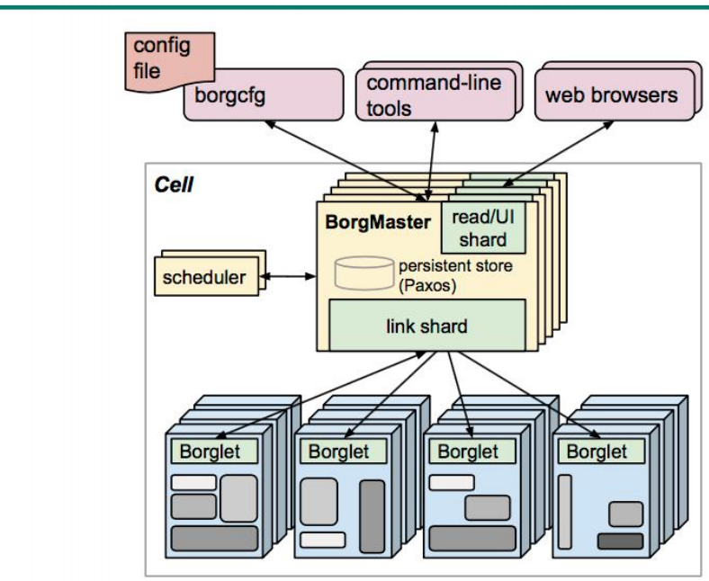
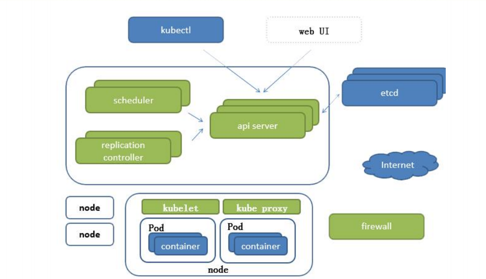
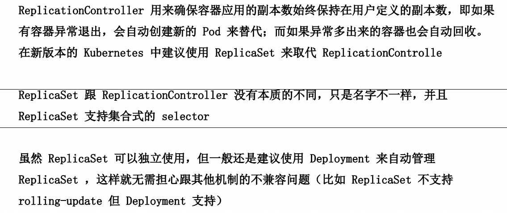

## k8s架构图





## 组件分类

```sh
APISERVER：所有服务访问统一入口
CrontrollerManager：维持副本期望数目
Scheduler：：负责介绍任务，选择合适的节点进行分配任务
ETCD：键值对数据库  储存K8S集群所有重要信息（持久化）
Kubelet：直接跟容器引擎交互实现容器的生命周期管理
Kube-proxy：负责写入规则至 IPTABLES、IPVS 实现服务映射访问的
COREDNS：可以为集群中的SVC创建一个域名IP的对应关系解析
DASHBOARD：给 K8S 集群提供一个 B/S 结构访问体系
INGRESS CONTROLLER：官方只能实现四层代理，INGRESS 可以实现七层代理
FEDERATION：提供一个可以跨集群中心多K8S统一管理功能
PROMETHEUS：提供K8S集群的监控能力
ELK：提供 K8S 集群日志统一分析介入平台
```

### ReplicationController




