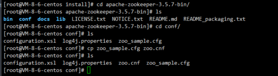
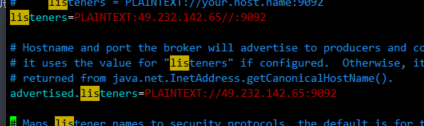
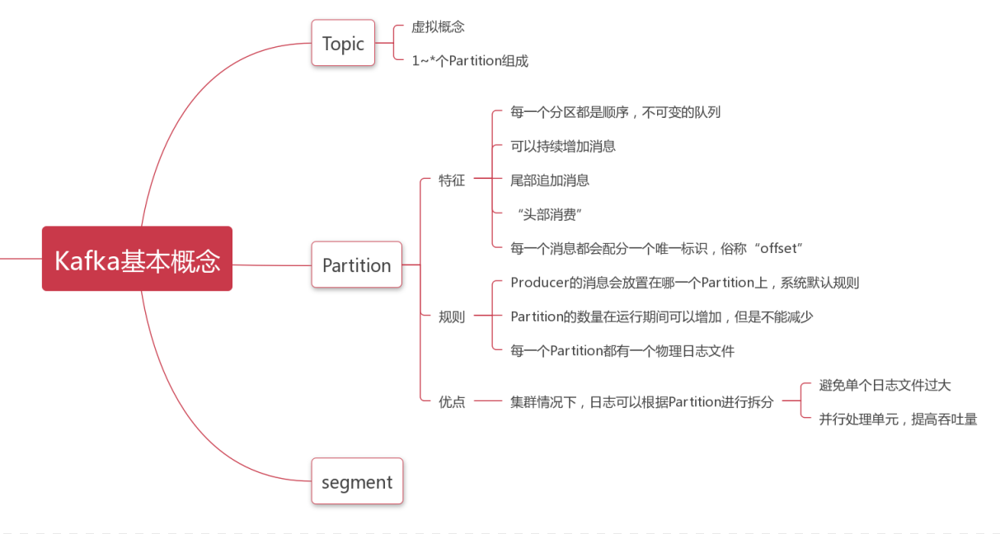
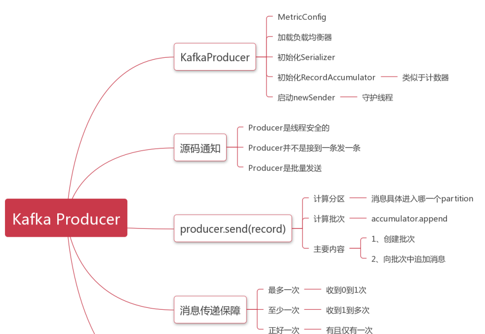

# 安装

```xml
apache-zookeeper
jdk
kafak
```





# 基本概念



# 基本命令

```sh
1、启动Kafka
bin/kafka-server-start.sh config/server.properties &
nohup bin/kafka-server-start.sh config/server.properties > logs/server-start.log 2>&1 &
2、停止Kafka
bin/kafka-server-stop.sh

3、创建Topic
bin/kafka-topics.sh --create --zookeeper localhost:2181 --replication-factor 1 --partitions 1 --topic test

4、查看已经创建的Topic信息
bin/kafka-topics.sh --list --zookeeper localhost:2181

5、发送消息
bin/kafka-console-producer.sh --broker-list 127.0.0.1:9092 --topic test

6、接收消息
bin/kafka-console-consumer.sh --bootstrap-server 127.0.0.1:9092 --topic test --from-beginning

{"orderId":"002","price":"80"}
```

# Producer




# 集群搭建

## zookeeper集群

```sh
3台机器都执行
vim zoo.cfg
加入
tickTime=2000
initLimit=10
syncLimit=5
dataDir=/opt/install/apache-zookeeper-3.5.7-bin/zkData
clientPort=2181
4lw.commands.whitelist=*
admin.serverPort=8071 
quorumListenOnAllIPs=true # 需要注意协议
server.1=47.101.130.87:2888:3888
server.2=49.232.142.65:2888:3888
server.3=81.69.172.101:2888:3888

3台机器都执行
/opt/install/apache-zookeeper-3.5.7-bin/zkData下面 touch myid文件
echo 1>myid  1为server.id的id
```


## kafka集群

```sh
# 基于zookeeper
# 修改 config下的zookeeper.properties
dataDir=/opt/install/apache-zookeeper-3.5.7-bin/zkData
# the port at which the clients will connect
clientPort=2181
# disable the per-ip limit on the number of connections since this is a non-production config
maxClientCnxns=0
# Disable the adminserver by default to avoid port conflicts.
# Set the port to something non-conflicting if choosing to enable this
admin.enableServer=false
# admin.serverPort=8080

# 修改server.properties --核心配置
broker.id=1
listeners=PLAINTEXT://172.17.32.236:9092
log.dirs=/opt/install/kafka_2.11-2.4.0/kafka-logs-1
zookeeper.connect=47.101.130.87:2181,49.232.142.65:2181,81.69.172.101:2181

# 启动 
./kafka-server-start.sh ../config/server.properties &

# 创建topic
./kafka-topics.sh --create --zookeeper 47.101.130.87:2181,49.232.142.65:2181,81.69.172.101:2181 --partitions 3 --replication-factor 3 --topic stream
# 显示所有topic
kafka-topics.sh --list --zookeeper localhost:2181 
# 查看topic详情
kafka-topics.sh --describe --zookeeper localhost:2181 --topic stream
# 删除topic
kafka-topics.sh --delete --zookeeper localhost:2181 --topic stream
# 生产者发布消息
kafka-console-producer.sh --broker-list slave2:9092 --topic stream
# 消费者消费消息
kafka-console-consumer.sh --bootstrap-server master:9092 \ 
--topic stream --from-beginning
```


# SSL

```sh
# 证书
mkdir -p /opt/cert;cd /opt/cert

创建密钥仓库，用于存储证书文件
keytool -keystore server.keystore.jks -alias kafka -validity 100000 -genkey
wxykafka
创建CA
openssl req -new -x509 -keyout ca-key -out ca-cert -days 100000

将生成的CA添加到客户信任库
keytool -keystore client.truststore.jks -alias CARoot -import -file ca-cert

为broker提供信任库以及所有客户端签名了密钥的CA证书
keytool -keystore server.truststore.jks -alias CARoot -import -file ca-cert

签名证书，用自己生成的CA来签名前面生成的证书
1、从密钥仓库导出证书
keytool -keystore server.keystore.jks -alias kafka -certreq -file cert-file

2、用CA签名：
openssl x509 -req -CA ca-cert -CAkey ca-key -in cert-file -out cert-signed -days 100000 -CAcreateserial -passin pass:wxykafka

3、导入CA的证书和已签名的证书到密钥仓库
keytool -keystore server.keystore.jks -alias CARoot -import -file ca-cert
keytool -keystore server.keystore.jks -alias kafka -import -file cert-signed

vim server.properties
listeners=PLAINTEXT://:9092,SSL://:8989
advertised.listeners=PLAINTEXT://47.101.130.87:9092,SSL://47.101.130.87:8989
ssl.keystore.location=/opt/cert/server.keystore.jks
ssl.keystore.password=wxykafka
ssl.key.password=wxykafka
ssl.truststore.location=/opt/cert/server.truststore.jks
ssl.truststore.password=wxykafka

# 启动

# 测试SSL是否成功
openssl s_client -debug -connect 47.101.130.87:8989 -tls1

# 客户端配置：
security.protocol=SSL
ssl.endpoint.identification.algorithm=
ssl.truststore.location=/opt/cert/client.truststore.jks
ssl.truststore.password=wxykafka

public static AdminClient adminClient() {
		Properties properties = new Properties();
		properties.setProperty(AdminClientConfig.BOOTSTRAP_SERVERS_CONFIG,"81.69.172.101:8989");
		properties.setProperty("security.protocol","SSL");
		properties.setProperty("ssl.endpoint.identification.algorithm","");
	    properties.setProperty("ssl.truststore.location","C:\\Users\\sailing\\Desktop\\wxy\\wxy\\project\\kafka\\src\\main\\resources\\client.truststore.jks");
		properties.setProperty("ssl.truststore.password","wxykafka");
		AdminClient adminClient = AdminClient.create(properties);
		return adminClient;
	}

```


# SASL

```sh
# 修改启动配置
将kafka/config目录下server.properties复制并重命名为server-sasl.properties，在配置文件末尾添加如下配置：
listeners=SASL_PLAINTEXT://192.168.1.1:9092
authorizer.class.name=kafka.security.auth.SimpleAclAuthorizer
security.inter.broker.protocol=SASL_PLAINTEXT
sasl.mechanism.inter.broker.protocol=PLAIN
sasl.enabled.mechanisms=PLAIN
super.users=User:admin

# 配置认证文件
在 kafka/config目录下创建kafka-server-jaas.conf文件，内容如下：
KafkaServer {
  org.apache.kafka.common.security.plain.PlainLoginModule required
  username="admin"
  password="admin"
  user_admin="admin"
};

# 修改启动脚本
将kafka/bin目录下kafka-server-start.sh复制并重命名为kafka-server-start-sasl.sh，打开文件,将最后一行的：
exec $base_dir/kafka-run-class.sh $EXTRA_ARGS kafka.Kafka "$@"
修改为(路径改为服务器的kafka路径)：
exec $base_dir/kafka-run-class.sh $EXTRA_ARGS -Djava.security.auth.login.config=/opt/install/kafka_2.11-2.4.0/config/kafka-server-jaas.conf kafka.Kafka "$@"

# 启动命令
./bin/kafka-server-start-sasl.sh config/server-sasl.properties
```


# 集群管理工具kafka-manager

## sbt安装

```sh
从sbt官网下载地址：https://www.scala-sbt.org/download.html
tar -zxvf sbt-1.1.4.tgz # 解压
cd /usr/software/sbt/ # 进入解压目录
vim sbt # 新建一个名字为sbt的文本，并在在文本中加入以下内容
#!/bin/bash
SBT_OPTS="-Xms512M -Xmx1536M -Xss1M -XX:+CMSClassUnloadingEnabled -XX:MaxPermSize=256M"
java $SBT_OPTS -jar /opt/install/sbt/bin/sbt-launch.jar "$@"  # 注意对应路径
# wq保存退出
chmod u+x ./sbt # 修改sbt脚本文件权限
sudo vim /etc/profile # 配置PATH环境变量
# 在文件最后添加：
export PATH=/usr/software/sbt/:$PATH
# wq保存退出
source /etc/profile # 使配置文件立刻生效

执行sbt sbtVersion
```


```sh
wget https://github.com/yahoo/kafka-manager/archive/2.0.0.2.tar.gz
# 下载2.0.0.2版本的kafka-manage
mv /opt/install/kafka-manager-2.0.0.2 /opt/install/kafka-manager2
cd /opt/install/kafka-manager2
vim sbt # 新建一个名字为sbt的文本，并在在文本中加入以下内容
#!/bin/bash
SBT_OPTS="-Xms512M -Xmx1536M -Xss1M -XX:+CMSClassUnloadingEnabled -XX:MaxPermSize=256M"
java $SBT_OPTS -jar /opt/install/sbt/bin/sbt-launch.jar "$@"  # 注意对应路径
# wq保存退出
chmod u+x ./sbt # 修改sbt脚本文件权限
./sbt clean package
########修改kafka-manager.zkhosts
vim /opt/install/kafka-manager2/conf/application.conf 

kafka-manager.zkhosts="localhost:2181"
#########启动默认地址是9000也可以通过 -Dhttp.port，指定端口; -Dconfig.file=conf/application.conf指定配置文件:
yum install coreutils
nohup --version
nohup /opt/install/kafka-manager2/bin/kafka-manager &
netstat -lntp|grep  9000
tcp        0      0 0.0.0.0:9000            0.0.0.0:*               LISTEN      26579/java 

```

