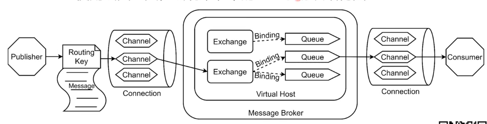

# 介绍

```css
amqp:https://blog.csdn.net/weixin_37641832/article/details/83270778

```

**AMQP协议中的概念**

- Broker: 接收和分发消息的应用，RabbitMQ 就是Message Broker
- Virtual Host: 虚拟Broker，将多个单元隔离开
- Connection: publisher／consumer和broker之间的TCP连接
- Channel: connection内部建立的逻辑连接，通常每个线程创建单独的channel
- Routing Key: 路由键，用来指示消息的路由转发，相当于快递的地址
- Exchange: 交换机，相当于快递的分拨中心，是AMQP中的核心概念
- Queue: 消息队列，消息最终被送到这里等待consumer取走
- Binding: exchange和queue之间的虚拟连接，用于message的分发依据

**状态查看**

- 查看状态：rabbitmqctl status
- 查看绑定：rabbitmqctl list_bindings
- 查看channel：rabbitmqctl list_channels
- 查看connection：rabbitmqctl list_connections
- 查看消费者：rabbitmqctl list_consumers
- 查看交换机：rabbitmqctl list_exchanges
- 查看队列：rabbitmqctl list_queues
- 删除队列：rabbitmqctl delete_queue
- 清空队列：rabbitmqctl purge_queue

**用户相关**

- 新建用户：rabbitmqctl add_user
- 修改用户密码：rabbitmqctl change_password

- 查看用户：rabbitmqctl list_users
- 设置用户角色：rabbitmqctl rabbitmqctl set_user_tags

**应用启停**

- 启动应用：rabbitmqctl start_app
- 关闭应用：rabbitmqctl stop_app，保留Erlang虚拟机（暂停）
- 关闭应用：rabbitmqctl stop，并关闭Erlang虚拟机
- 以应后台用方式启动 rabbitmq-server -detached 
-  rabbitmq-service install 安装服务 
- rabbitmq-service start 开始服务
-  Rabbitmq-service stop 停止服务 
- Rabbitmq-service enable 使服务有效
- Rabbitmq-service disable 使服务无效

**集群相关**

- 加入集群：rabbitmqctl join_cluster
- 离开集群：rabbitmqctl reset

**镜像队列**

- 设置镜像队列：rabbitmqctl sync_queue
- 取消镜像队列：rabbitmqctl cancel_sync_queue

**Rabbitmq 管理插件启动，可视化界面** 

rabbitmq-plugins enable rabbitmq_management 启动

 rabbitmq-plugins disable rabbitmq_management 关闭 